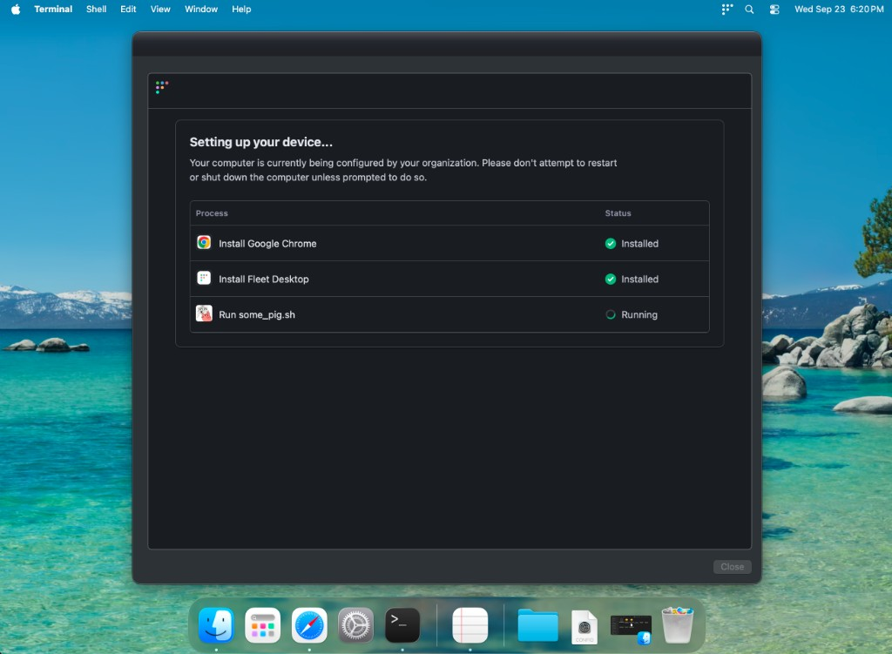

# Interlude

A post-login setup tracker designed for non-ADE Macs enrolling into Fleet. 

> **NOTE**: This is a community project, not officially supported by Fleet. It is not designed to replace Fleet's native setup experience feature for Macs going through Automated Device Enrollment (ADE).

## How it works

1. Reads the Fleet server URL from fleetd's managed preferences and the device token from `/opt/orbit/identifier`.
2. Builds the step list from `STEPS` (title names or numeric title IDs), or from every available self-service title if `AUTO_DISCOVER=true`.
3. If swiftDialog isn't on disk (common after a manual MDM enrollment), downloads only Fleet's swiftDialog TUF target into the orbit path. It doesn't reinstall fleetd.
4. Skips titles that are already installed, then queues the rest with `POST /api/latest/fleet/device/{token}/software/install/{title_id}`.
5. Polls `GET /api/latest/fleet/device/{token}/software` and the local filesystem, updating the window until each step finishes or `MAX_WAIT_SECONDS` runs out.
6. Writes `/var/db/fleet-interlude.done` as a sentinel.

## Security

Fleet Interlude authenticates with the host's Fleet Desktop device token, not a Fleet API token, so the script holds no admin credentials.

- **The token rotates.** orbit generates a random UUID, registers it with Fleet over orbit's own authenticated channel, and writes it to `/opt/orbit/identifier` on the host. orbit replaces it every hour, and Fleet rejects any token older than one hour. The token is never written to the logs. See [Secure Fleet Desktop](https://fleetdm.com/guides/fleet-desktop#secure-fleet-desktop).
- **The token is scoped to one host.** It only authenticates the `/api/latest/fleet/device/{token}/...` routes, and those only act on the host that owns the token: reading that host's software, queueing its self-service installs, and reading its install results. See [Fleet-desktop-token-authenticated routes](https://github.com/fleetdm/fleet/blob/main/docs/Contributing/reference/api-for-contributors.md#fleet-desktop-token-authenticated-routes).
- **Installs are limited to self-service titles.** The install endpoint rejects any title that isn't marked `self_service`. See [Install self-service software by Fleet Desktop token](https://fleetdm.com/docs/rest-api/rest-api#install-self-service-software-by-fleet-desktop-token).

> **Single sign-on (SSO) for Fleet Desktop** adds additional authentication requirements. See the [Fleet-desktop-token-authenticated routes reference](https://github.com/fleetdm/fleet/blob/main/docs/Contributing/reference/api-for-contributors.md#fleet-desktop-token-authenticated-routes) for how the session requirement, error responses, and exemptions (including during setup experience) work. Interlude has not yet been fully validated with these settings enabled.

## Deploy

1. Edit the `CONFIGURATION` block at the top of the script.
2. Upload the script under **Controls > Scripts**.
3. Run it manually on a host, or attach it to a policy automation.

> For an example production deployment, see [Example deployment](example-deployment.md).

## Configuration

| Variable               | Default      | Purpose                                                                            |
| ---------------------- | ------------ | ---------------------------------------------------------------------------------- |
| `STEPS`                | example list | Titles to install, by name or ID. Use an ID when two titles share a name.          |
| `AUTO_DISCOVER`        | `false`      | If `STEPS` is empty, install every available self-service title.                   |
| `SERIAL_STEPS`         | `true`       | Queue one title at a time, in `STEPS` order.                                       |
| `SERIAL_ON_FAIL`       | `stop`       | In serial mode, `stop` or `skip` after a step fails.                               |
| `DRY_RUN`              | `false`      | `true` logs what would be queued without installing.                               |
| `DETACH`               | `true`       | Hand off live runs to a one-shot LaunchDaemon (see Timing).                        |
| `BLUR_SCREEN`          | `true`       | Full-screen kiosk with a blur. `false` shows a resizable window that stays on top. |
| `COLOR_MODE`           | `auto`       | `light`, `dark`, or `auto` (follows the user's macOS appearance).                  |
| `REQUIRE_CONSOLE_USER` | `false`      | Exit with code 2 if nobody is logged in.                                           |
| `MAX_WAIT_SECONDS`     | `3600`       | Overall install timeout.                                                           |
| `HEADER_LOGO_URL`      | Fleet mark   | HTTPS logo above the tracker. Leave empty to hide it.                              |
| `FLEET_URL`            | empty        | Overrides the Fleet server URL the script detects.                                 |

The `WINDOW_TITLE_*` and `WINDOW_MESSAGE_*` variables set the window text.

## Command-line flags

These flags only apply when you run the script by hand, for example `sudo ./fleet-interlude.sh --force --no-blur`.

- `--force`: re-run even if the done marker exists.
- `--debug`: log extra detail for script-package installs.
- `--no-blur`: use a normal window instead of the kiosk.
- `--serial` / `--parallel`: override `SERIAL_STEPS`.
- `--serial-on-fail stop|skip`: override `SERIAL_ON_FAIL`.
- `--color-mode light|dark|auto` (or `--light`, `--dark`, `--auto`): override `COLOR_MODE`.

## Timing

Installing several titles usually takes longer than Fleet's default 300-second script timeout. With `DETACH=true`, live runs copy the script to `/var/db/fleet-interlude/` and continue under the LaunchDaemon `com.fleet.interlude`, so Fleet records the script as successful while installs keep going. 

If you set `DETACH=false`, you may experience timeout errors. To get around this you can [raise the default script execution timeout](https://fleetdm.com/docs/configuration/agent-configuration#script-execution-timeout) (`agent_options.script_execution_timeout`).

## Logs and exit codes

- The in-process run logs to stdout, which shows under **Host details > Activity** in Fleet.
- The detached worker logs to `/var/log/fleet-interlude.log`.

| Code | Meaning                                                                      |
| ---- | ---------------------------------------------------------------------------- |
| `0`  | Success, including "already completed" and dry runs.                         |
| `1`  | Misconfiguration, not root, missing token, URL, or swiftDialog, or no steps. |
| `2`  | `REQUIRE_CONSOLE_USER=true` and no user is logged in.                        |

## Re-running

To run it again on a host, delete `/var/db/fleet-interlude.done` or pass `--force`.